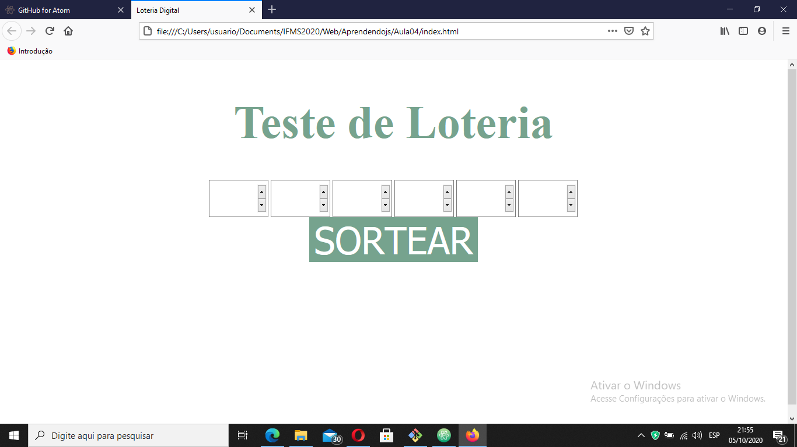

# loteria

Este projeto e um simulador da megassena, onde o usuario digita seis numeros e sorteamos aleatoriamente outros seis numeros e comparamos para verificar quantos numeros voce acertou.

**Nao é para jogos oficiais**

## Tecnologias Utilizadas
1. **HTML**: HTML é uma linguagem de marcação utilizada na construção de páginas na Web.
2. **CSS**: Cascading Style Sheets é um mecanismo para adicionar (cores, fontes, espacamento, etc..) a um documento web.
3. **JS**:JavaScript é uma linguagem de programação interpretada estruturada, de script em alto nível com tipagem dinâmica fraca e multiparadigma. Juntamente com HTML e CSS, o JavaScript é uma das três principais tecnologias da World Wide Web.
4.~~**Jquery**~~:Nao foi utilizado.

## Funcoes Principais
Aqui sera apresentado as duas funcoes principais do site


### Sorteio de Numeros
Nessa funcao os numeros sao sorteados aleatoriamente
```
function sortearNumeros() {
  numSort=[];
  let sort;
  for (var i = 0; i < 6; i++) {
    do {
      let sort = Math.ceil(Math.random()*60);
      sort=(sort==0)? 1 : sort;

    } while (numSort.includes(sort)));
      numSort.push(sort);
  }

}
```
### Lendo os Numeros Digitados
Le as entradas de numeros utilizados pelo usuario
```
function addToList(num,pos) {
  if (num.length==2) {
    if (numEsco.includes(num)) {
      alert("Numero Escolhido Anteriormente. Digite outro numero")

    }else if (parseInt(num)>60) {
        alert("O numero digitado nao pode ser ,aior que 60")
    }else {
      numEsco[pos-1]= num;
    }
  }

```
## Como Rodar o codigo
> Simplesmente baixe e o codigo e abra o arquivo **_index.html_** no seu navegador

## Exemplo de tabela
Exemplo | Valor do exemplo| quantidade
--------|-----------------|-----------
Exemplo1|R$ 10            |5
exemplo2|R$ 15            |6
exemplo3|R$ 25            |10

## Imagens da tela
tela 1



#### Referencias
* HTML: [Wikipedia](https://pt.wikipedia.org/wiki/HTML)
* CSS: [W3Shools](https://en.wikipedia.org/wiki/CSS)
* JS: [Wikipedia](https://pt.wikipedia.org/wiki/JavaScript)
